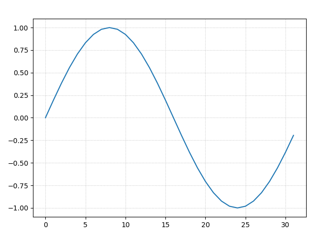
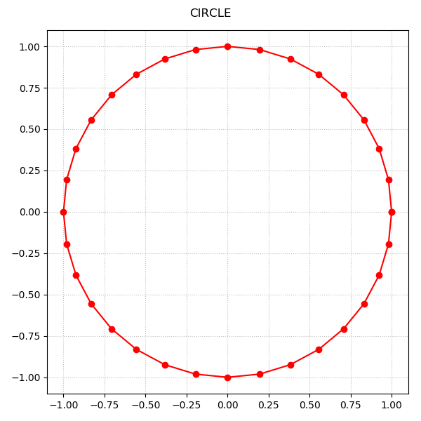
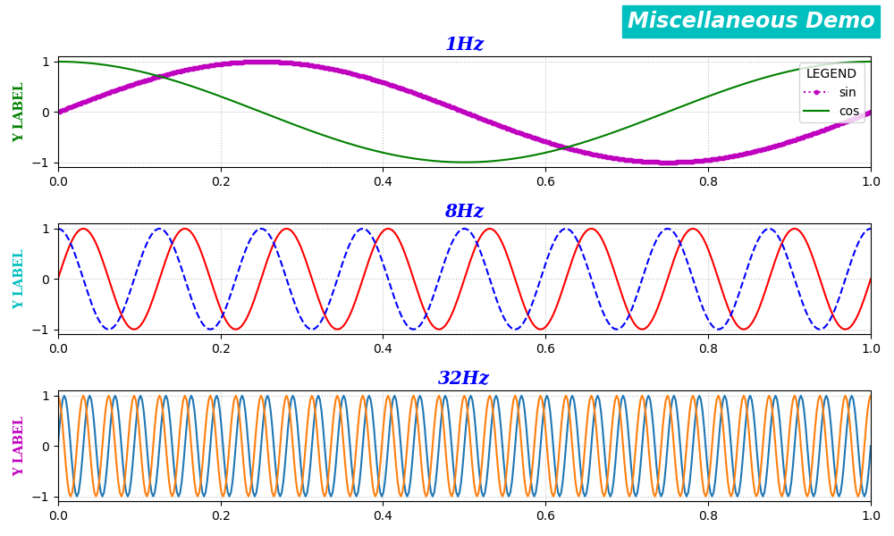

# Lite Plot Library for Python (LitePlotLib)

PythonのMatplotlibを使ってグラフを作成する手順が面倒だったので、お手軽に簡単にグラフを作成できるようにしました。

# DEMO

以下のコードの最後の２行のような簡単な記述でインスタントにグラフを表示できます。

```python
## Prepare plot data
import math
data = [ math.sin(2.0*math.pi*t/32.0) for t in range(32) ]

# Plot
from liteplotlib import plot
plot(data)
```

結果

|[](./fig1.png)|
|:-:|


別の例です

```python
## Prepare plot data
import math
tdata = [ t/32.0 for t in range(33) ]
xdata = [ math.cos(2.0*math.pi*t) for t in tdata ]
ydata = [ math.sin(2.0*math.pi*t) for t in tdata ]

# Plot
from liteplotlib import plot
plot(xdata, ydata, 'o-r', 'CIRCLE', (600, 600))
```

結果

|[](./fig2.png)|
|:-:|

**plot** の引数には、X座標とY座標のデータ、グラフのタイトル、ウィンドウサイズを渡すことができます。

また、これと同じことは **LitePlotLib** クラスのインスタンスを使って実現することもできます。以下のコードを実行すると上と同じ結果が得られます。

```python
## Prepare plot data
import math
tdata = [ t/32.0 for t in range(33) ]
xdata = [ math.cos(2.0*math.pi*t) for t in tdata ]
ydata = [ math.sin(2.0*math.pi*t) for t in tdata ]

# Plot
from liteplotlib import LitePlotLib
myplt = LitePlotLib(xdata, ydata, 'o-r')
myplt.set_window_size(600, 600)
myplt.set_graph_title('CIRCLE')
myplt.set_axes_xlim(auto=True)
myplt.set_axes_ylim(auto=True)
myplt.show()
```

**LitePlotLib** インスタンスを使う方法は **plot** よりも複雑になりますが、より細かい制御が可能になります。


# Features

X軸、Y軸のそれぞれを独立に対数スケール、リニアスケール、その他のスケールに設定できます。（**set_axes_xscale()**, **set_axes_yscale()**）

グラフを拡大したり平行移動する際に他のグラフ（Axes）のX軸、Y軸の範囲が連動して動くよう設定できます。（**set_sharex(**_True_**)**, **set_sharey(**_True_**)**）

一部のメソッドはMatplotlibのオプションを受け付ける（オプションをMatplotlibへパススルーする）ので、ひと手間かければ以下のようなファンシーなグラフも作成できます。

|[](./example6.png)|
|:-:|

また、グラフを画像やプロットデータとしてファイルに保存できます。（**savefig()**, **save_plot_data()**. 例題：[example6.py](./example6.py)）

**save_plot_data()** で保存されたプロットデータのファイルはリストア（読み込んで表示）することが可能です。（**restore_plot_data()**. 例題：[example7.py](./example7.py)）

# Requirement

LitePlotLibの動作に必要なものは以下です。

* Python3
* Matplotlib

# Usage

#### お手軽にグラフを表示する場合
**liteplotlib** を *import* し **plot**(x, y=None, fmt=None, title='', size=None) の引数にデータをセットして実行します。

#### 少し凝ったグラフにしたい場合
**liteplotlib** を *import* し、**LitePlotLib** のインスタンスを生成し、インスタンスにデータをセットし、インスタンスに様々な設定をして **show()** メソッドを呼び出します。

**LitePlotLib** の詳しい使い方は例題ファイル `example1.py` ～ `example7.py` の中身をご覧ください。
また、**LitePlotLib** のメソッド（API）の詳細説明については [API.md](./API.md) をご覧ください。

# License

**LitePlotLib** is under [MIT license](https://en.wikipedia.org/wiki/MIT_License).  
```text
Copyright (c) 2025 Kitanokitsune

Permission is hereby granted, free of charge, to any person obtaining a copy
of this software and associated documentation files (the "Software"), to deal
in the Software without restriction, including without limitation the rights
to use, copy, modify, merge, publish, distribute, sublicense, and/or sell
copies of the Software, and to permit persons to whom the Software is
furnished to do so, subject to the following conditions:

The above copyright notice and this permission notice shall be included in all
copies or substantial portions of the Software.

THE SOFTWARE IS PROVIDED "AS IS", WITHOUT WARRANTY OF ANY KIND, EXPRESS OR
IMPLIED, INCLUDING BUT NOT LIMITED TO THE WARRANTIES OF MERCHANTABILITY,
FITNESS FOR A PARTICULAR PURPOSE AND NONINFRINGEMENT. IN NO EVENT SHALL THE
AUTHORS OR COPYRIGHT HOLDERS BE LIABLE FOR ANY CLAIM, DAMAGES OR OTHER
LIABILITY, WHETHER IN AN ACTION OF CONTRACT, TORT OR OTHERWISE, ARISING FROM,
OUT OF OR IN CONNECTION WITH THE SOFTWARE OR THE USE OR OTHER DEALINGS IN THE
SOFTWARE.
```
